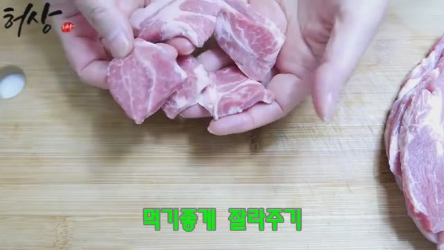

# clipnote

Turns how-to videos into follow-along documents, with real video frames at the ambiguous moments.

Instructions like *"cut it bite-sized"* or *"simmer until the sauce reduces"* don't mean much as text. clipnote finds the frame where that state is actually visible and embeds it next to the step. It works across domains — cooking, repair, crafts, beauty, fitness, software — and exports to Notion, Obsidian, and Goodnotes.

Gemini analyzes the video itself (visuals and audio), so it works on videos without captions, and when the narration runs ahead of the action.

## Example

Generated from [this pork stir-fry video](https://youtu.be/4ioPBiTWm3M). Where the video only says *"simmer until the sauce reduces"*, the document reads:

> 2\. **Simmer the pork in the sauce**
> - Add 1/2 cup water, 1T brown sugar, 1T syrup to the pan; once dissolved, add the pork. …
> - 💡 *"Reduced" means:* almost no liquid left on the pan bottom, sauce clinging to the meat with a glossy sheen.
>
> 

And *"cut it bite-sized"*:

> - 💡 *"Bite-sized" means:* roughly 3–4 cm cubes.
>
> 

## Install

```bash
pip install -r requirements.txt   # yt-dlp, reportlab, opencv-python-headless
# system dependency: ffmpeg (on PATH)
export GEMINI_API_KEY=...          # Google AI Studio key
```

## Usage

One command runs the whole pipeline.

```bash
# 1) Fully automatic (no ffmpeg; timestamp links instead of screenshots)
python pipeline.py "https://www.youtube.com/watch?v=..." --profile generic --language en --links-only

# 2) With screenshots + export
python pipeline.py "https://www.youtube.com/watch?v=..." --profile recipe --language en
#   → open the printed picker.html, pick one candidate per guide, save picks.json
python pipeline.py "https://www.youtube.com/watch?v=..." --profile recipe --language en \
    --picks work/frames/<id>/recipe.en/picks.json --export goodnotes
```

Options: `--profile generic|recipe`, `--language ko|en|ja|...`, `--max-guides N`, `--model`, `--export bundle|obsidian|goodnotes`.

## Note app export

| Target | How | Status |
|--------|-----|--------|
| Obsidian | Markdown + attachments copied into a vault folder | done |
| Goodnotes | PDF (CJK fonts supported) for the import/share flow | done |
| Notion | `bundle/` (document.md + manifest.json + images) for the File Upload API | upload-ready |

```bash
python export.py <id> --profile recipe --language en --target obsidian --destination /path/to/vault
python export.py <id> --profile recipe --language en --target goodnotes
```

## Reusing clipnote

Two reuse boundaries:

1. **`skill-core/`** — language-neutral assets: `profiles/<name>/{prompt.md, schema.json, template.md}` and `engine/rules.md`. Any platform can consume these as data.
2. **The Python modules** — reusable wherever Python runs.

| Consumer | How |
|----------|-----|
| REST API server | wraps the modules — see [clipnote-server](https://github.com/zlej123/clipnote-server) |
| Desktop app / Python tools / agent skills | import directly (see `SKILL.md`) |
| Native iOS/macOS app | call [clipnote-server](https://github.com/zlej123/clipnote-server), or reuse `skill-core/` in Swift (see `docs/apple-brief.md`) |

A browser client lives at [clipnote-extension](https://github.com/zlej123/clipnote-extension) — it captures frames from the YouTube player itself, no server needed.

## Adding a domain profile

Drop three files into `skill-core/profiles/<name>/`: `prompt.md` (containing `{{RULES}}`), `schema.json`, `template.md`. No pipeline changes needed.

## Tests

```bash
python -m unittest discover -s tests        # contract / normalization / selection / export
python tests/validate_fixtures.py --online  # fixture availability + strata
python tests/batch.py                        # 6-domain structural + semantic regression
```

`tests/fixtures/urls.json` is a regression corpus of 8–12 videos per domain, stratified by length, audio, captions, editing style, framing, and source language.

## Limits

- Public videos only; under 30 minutes recommended.
- Free-tier Gemini rate-limits under batch load. Default model is `gemini-flash-lite-latest`.
- Timestamps are accurate to about ±2–3 s; the before/center/after candidates cover the gap.
- Not useful for videos with nothing visual to show (lectures, vlogs, reviews).

## License

MIT
